# 🛠️ DEVELOPMENT GUIDE - Affiliate Strategist

> **Guía completa para desarrolladores - Versión 1.3**

## 📋 Tabla de Contenidos

1. [Estructura del Proyecto](#estructura-del-proyecto)
2. [Setup de Desarrollo](#setup-de-desarrollo)
3. [Arquitectura y Flujo](#arquitectura-y-flujo)
4. [Modelos de Datos](#modelos-de-datos)
5. [Comandos Útiles](#comandos-útiles)
6. [Agregar Funcionalidades](#agregar-funcionalidades)
7. [Debugging y Testing](#debugging-y-testing)
8. [Deployment](#deployment)
9. [Troubleshooting](#troubleshooting)

---

## 📁 Estructura del Proyecto

### Estructura Completa del Repositorio

```
Afiliate_strategist/                    # ← REPOSITORIO GITHUB
│
├── 📄 README.md                        # Documentación principal
├── 📄 DEVELOPMENT_GUIDE.md             # Esta guía
├── 📄 API_DOCUMENTATION.md             # Documentación API
├── 📄 LICENSE                          # Licencia MIT
│
└── 📁 affiliate_strategist/            # ← PROYECTO DJANGO
    │
    ├── 📁 analyzer/                    # App principal
    │   ├── __init__.py
    │   ├── admin.py                    # Configuración del admin
    │   ├── apps.py                     # Configuración de la app
    │   ├── models.py                   # MODELOS (AnalysisHistory, UserProfile, etc.)
    │   ├── views.py                    # VISTAS (IndexView, HistoryView, etc.)
    │   ├── urls.py                     # URLs de la app
    │   ├── forms.py                    # Formularios Django
    │   ├── ai_handler.py               # Integración con Gemini AI
    │   ├── utils.py                    # Utilidades generales
    │   │
    │   ├── 📁 templates/analyzer/      # Templates HTML
    │   │   ├── base.html               # Template base
    │   │   ├── index.html              # Página principal
    │   │   ├── results.html            # Resultados del análisis
    │   │   ├── history.html            # Historial de análisis
    │   │   └── profile.html            # Perfil de usuario
    │   │
    │   ├── 📁 static/analyzer/         # Archivos estáticos de la app
    │   │   ├── css/                    # Estilos CSS
    │   │   ├── js/                     # JavaScript
    │   │   └── img/                    # Imágenes
    │   │
    │   ├── 📁 management/              # Comandos personalizados
    │   │   └── commands/
    │   │       ├── load_templates.py   # Cargar plantillas iniciales
    │   │       └── cleanup_old.py      # Limpiar datos antiguos
    │   │
    │   └── 📁 migrations/              # Migraciones de BD
    │       ├── 0001_initial.py
    │       └── ...
    │
    ├── 📁 affiliate_strategist/        # Configuración del proyecto
    │   ├── __init__.py
    │   ├── settings.py                 # CONFIGURACIÓN PRINCIPAL
    │   ├── urls.py                     # URLs principales
    │   ├── wsgi.py                     # WSGI para producción
    │   └── asgi.py                     # ASGI (opcional)
    │
    ├── 📁 static/                      # Archivos estáticos globales
    │   ├── css/
    │   ├── js/
    │   └── img/
    │
    ├── 📁 media/                       # Archivos subidos
    │   └── avatars/                    # Avatares de usuarios
    │
    ├── 📁 venv/                        # Entorno virtual (NO SUBIR)
    │
    ├── 📄 manage.py                    # Script principal Django
    ├── 📄 requirements.txt             # Dependencias Python
    ├── 📄 db.sqlite3                   # Base de datos SQLite
    ├── 📄 .env                         # Variables de entorno (NO SUBIR)
    └── 📄 .gitignore                   # Archivos a ignorar
```

---

## 🚀 Setup de Desarrollo

### 1. Clonar y Preparar

```bash
# Clonar repositorio
git clone https://github.com/Sinsapiar1/Afiliate_strategist.git
cd Afiliate_strategist

# IMPORTANTE: Entrar a la carpeta del proyecto Django
cd affiliate_strategist

# Crear entorno virtual
python -m venv venv

# Activar entorno
# Windows:
venv\Scripts\activate
# Linux/Mac:
source venv/bin/activate
```

### 2. Instalar Dependencias

```bash
# Actualizar pip
python -m pip install --upgrade pip

# Instalar dependencias
pip install -r requirements.txt
```

### 3. Configurar Variables de Entorno

Crear archivo `.env` en `affiliate_strategist/`:

```env
# Django
SECRET_KEY=django-insecure-tu-clave-super-segura
DEBUG=True
ALLOWED_HOSTS=localhost,127.0.0.1

# Database (opcional, por defecto SQLite)
DATABASE_URL=sqlite:///db.sqlite3

# API Keys (opcional)
GEMINI_API_KEY=AIza...

# Email (opcional)
EMAIL_HOST=smtp.gmail.com
EMAIL_PORT=587
EMAIL_USE_TLS=True
EMAIL_HOST_USER=tu-email@gmail.com
EMAIL_HOST_PASSWORD=tu-app-password
```

### 4. Inicializar Base de Datos

```bash
# Crear migraciones
python manage.py makemigrations

# Aplicar migraciones
python manage.py migrate

# Crear superusuario (opcional)
python manage.py createsuperuser

# Cargar datos iniciales (si existe el comando)
python manage.py loaddata initial_data.json
```

### 5. Ejecutar Servidor

```bash
python manage.py runserver
# Servidor corriendo en http://127.0.0.1:8000
```

---

## 🏗️ Arquitectura y Flujo

### Flujo de Análisis

```mermaid
graph TD
    A[Usuario ingresa URL] --> B[IndexView procesa form]
    B --> C{¿Datos válidos?}
    C -->|Sí| D[Scraping del producto]
    C -->|No| E[Mostrar errores]
    D --> F[Llamada a Gemini AI]
    F --> G[Guardar en AnalysisHistory]
    G --> H[Mostrar resultados]
    H --> I[Opción de descargar PDF]
```



### Componentes Principales

#### 1. **Views (analyzer/views.py)**

```python
class IndexView(View):
    """Vista principal - Formulario de análisis"""
    
    def get(self, request):
        # Muestra formulario
        
    def post(self, request):
        # Procesa análisis
        # 1. Valida datos
        # 2. Scraping
        # 3. Llama a AI
        # 4. Guarda resultado
        # 5. Retorna respuesta

class HistoryView(LoginRequiredMixin, View):
    """Historial de análisis del usuario"""
    
class ProfileView(LoginRequiredMixin, View):
    """Perfil y estadísticas del usuario"""
```

#### 2. **Models (analyzer/models.py)**

```python
# Modelos principales con sus relaciones
AnalysisHistory     # Análisis realizados
UserProfile         # Perfiles de usuario
MarketingTemplate   # Plantillas de marketing
Notification        # Sistema de notificaciones
AnalysisFeedback   # Feedback de usuarios
DailyMetrics       # Métricas del sistema
```

#### 3. **AI Handler (analyzer/ai_handler.py)**

```python
def generate_marketing_strategy(product_data, platform, audience, gemini_key):
    """
    Genera estrategia usando Gemini AI
    """
    # 1. Construye prompt
    # 2. Llama a Gemini
    # 3. Procesa respuesta
    # 4. Retorna estrategia formateada
```

---

## 💾 Modelos de Datos

### Modelo Principal: AnalysisHistory

```python
class AnalysisHistory(models.Model):
    # Identificación
    id = UUIDField(primary_key=True)
    user = ForeignKey(User)
    
    # Producto
    product_url = URLField()
    product_title = CharField()
    product_price = CharField()
    
    # Configuración
    platform = CharField(choices=PLATFORMS)
    target_audience = CharField()
    campaign_goal = CharField()
    
    # Resultados
    ai_response = TextField()
    success = BooleanField()
    
    # Timestamps
    created_at = DateTimeField(auto_now_add=True)
```

### Sistema de Usuarios: UserProfile

```python
class UserProfile(models.Model):
    user = OneToOneField(User)
    
    # Plan y límites
    plan = CharField(choices=['free', 'pro', 'premium'])
    analyses_limit_monthly = IntegerField()
    analyses_this_month = IntegerField()
    
    # Estadísticas
    total_analyses = IntegerField()
    points = IntegerField()
    level = IntegerField()
    
    # Importante: Campo timezone
    timezone = CharField(max_length=50, default='UTC')
    last_reset_date = DateField(default=django_timezone.now)
```

### ⚠️ IMPORTANTE: Conflicto de Nombres

El modelo `UserProfile` tiene un campo llamado `timezone` que puede conflictar con el import de Django. Por eso usamos:

```python
from django.utils import timezone as django_timezone
```

---

## 🔧 Comandos Útiles

### Django Management

```bash
# Servidor de desarrollo
python manage.py runserver

# Migraciones
python manage.py makemigrations
python manage.py migrate
python manage.py showmigrations

# Shell interactivo
python manage.py shell

# Crear superusuario
python manage.py createsuperuser

# Recolectar estáticos
python manage.py collectstatic

# Limpiar sesiones
python manage.py clearsessions
```

### Comandos Personalizados

```bash
# Cargar plantillas iniciales
python manage.py load_templates

# Limpiar análisis antiguos
python manage.py cleanup_old_analyses --days 30

# Resetear contadores mensuales
python manage.py reset_monthly_counters

# Generar datos de prueba
python manage.py generate_test_data --users 10 --analyses 50
```

### Git Workflow

```bash
# Crear branch para nueva funcionalidad
git checkout -b feature/nueva-funcionalidad

# Commits semánticos
git commit -m "feat: agregar sistema de notificaciones"
git commit -m "fix: corregir error en timezone"
git commit -m "docs: actualizar README"
git commit -m "style: formatear código PEP8"
git commit -m "refactor: simplificar lógica de análisis"
git commit -m "test: agregar tests para UserProfile"
git commit -m "chore: actualizar dependencias"

# Push y crear PR
git push origin feature/nueva-funcionalidad
```

---

## ➕ Agregar Funcionalidades

### Ejemplo 1: Agregar Nueva Plataforma

#### 1. Actualizar choices en models.py

```python
# analyzer/models.py
PLATFORM_CHOICES = [
    ('tiktok', 'TikTok'),
    ('instagram', 'Instagram'),
    ('threads', 'Threads'),  # NUEVA
    # ...
]
```

#### 2. Agregar en el template

```html
<!-- analyzer/templates/analyzer/index.html -->
<select name="platform" class="form-select">
    <option value="tiktok">TikTok</option>
    <option value="instagram">Instagram</option>
    <option value="threads">Threads</option>  <!-- NUEVA -->
</select>
```

#### 3. Actualizar prompt de AI

```python
# analyzer/ai_handler.py
PLATFORM_STRATEGIES = {
    'threads': """
    Genera estrategia para Threads:
    - Posts conversacionales
    - Engagement con la comunidad
    - Formato texto + imagen
    """
}
```

#### 4. Migrar

```bash
python manage.py makemigrations
python manage.py migrate
```

### Ejemplo 2: Agregar Sistema de Cache

```python
# analyzer/views.py
from django.core.cache import cache
import hashlib

def generate_cache_key(url, platform, audience):
    """Genera clave única para cache"""
    data = f"{url}_{platform}_{audience}"
    return hashlib.md5(data.encode()).hexdigest()

class IndexView(View):
    def post(self, request):
        # Generar clave de cache
        cache_key = generate_cache_key(
            request.POST.get('product_url'),
            request.POST.get('platform'),
            request.POST.get('target_audience')
        )
        
        # Verificar cache
        cached_result = cache.get(cache_key)
        if cached_result:
            return JsonResponse({
                **cached_result,
                'from_cache': True
            })
        
        # Si no está en cache, generar
        result = self.generate_analysis(request)
        
        # Guardar en cache por 1 hora
        cache.set(cache_key, result, 3600)
        
        return JsonResponse(result)
```

---

## 🧪 Debugging y Testing

### Tests Básicos

```python
# analyzer/tests.py
from django.test import TestCase, Client
from django.contrib.auth.models import User
from .models import AnalysisHistory, UserProfile

class AnalyzerTestCase(TestCase):
    def setUp(self):
        self.client = Client()
        self.user = User.objects.create_user(
            username='testuser',
            password='testpass123'
        )
    
    def test_homepage_loads(self):
        """Test que la página principal carga"""
        response = self.client.get('/')
        self.assertEqual(response.status_code, 200)
    
    def test_user_profile_creation(self):
        """Test que se crea perfil al crear usuario"""
        self.assertTrue(hasattr(self.user, 'profile'))
        self.assertEqual(self.user.profile.plan, 'free')
    
    def test_analysis_limit(self):
        """Test límites de análisis por plan"""
        profile = self.user.profile
        profile.analyses_this_month = 5
        profile.save()
        
        self.assertFalse(profile.can_analyze())
```

### Ejecutar Tests

```bash
# Todos los tests
python manage.py test

# App específica
python manage.py test analyzer

# Test específico
python manage.py test analyzer.tests.AnalyzerTestCase.test_homepage_loads

# Con coverage
pip install coverage
coverage run --source='.' manage.py test
coverage report
coverage html  # Genera reporte HTML
```

### Debug en Shell

```python
# python manage.py shell
from analyzer.models import AnalysisHistory, UserProfile
from django.contrib.auth.models import User

# Ver últimos análisis
AnalysisHistory.objects.all().order_by('-created_at')[:5]

# Verificar perfil de usuario
user = User.objects.get(username='testuser')
user.profile.analyses_remaining

# Resetear contador mensual
user.profile.reset_monthly_counter_if_needed()

# Ver análisis fallidos
AnalysisHistory.objects.filter(success=False).count()
```

### Logging

```python
# analyzer/views.py
import logging
logger = logging.getLogger(__name__)

class IndexView(View):
    def post(self, request):
        logger.info(f"Iniciando análisis para: {request.POST.get('product_url')}")
        
        try:
            # Código del análisis
            result = generate_analysis()
            logger.info(f"Análisis exitoso: {result['id']}")
            
        except Exception as e:
            logger.error(f"Error en análisis: {str(e)}", exc_info=True)
            # Manejar error
```

---

## 🚀 Deployment

### Pre-Deployment Checklist

```bash
# 1. Tests pasando
python manage.py test

# 2. Check de seguridad
python manage.py check --deploy

# 3. Collectstatic
python manage.py collectstatic --noinput

# 4. Comprimir archivos
python manage.py compress  # Si usas django-compressor

# 5. Actualizar requirements
pip freeze > requirements.txt
```

### Configuración de Producción

```python
# affiliate_strategist/settings_prod.py
from .settings import *

DEBUG = False
ALLOWED_HOSTS = ['tu-dominio.com', 'www.tu-dominio.com']

# Seguridad
SECURE_SSL_REDIRECT = True
SESSION_COOKIE_SECURE = True
CSRF_COOKIE_SECURE = True
SECURE_BROWSER_XSS_FILTER = True
SECURE_CONTENT_TYPE_NOSNIFF = True

# Base de datos PostgreSQL
DATABASES = {
    'default': {
        'ENGINE': 'django.db.backends.postgresql',
        'NAME': os.environ.get('DB_NAME'),
        'USER': os.environ.get('DB_USER'),
        'PASSWORD': os.environ.get('DB_PASSWORD'),
        'HOST': os.environ.get('DB_HOST'),
        'PORT': '5432',
    }
}

# Cache con Redis
CACHES = {
    'default': {
        'BACKEND': 'django.core.cache.backends.redis.RedisCache',
        'LOCATION': os.environ.get('REDIS_URL'),
    }
}
```

### Deploy con Gunicorn + Nginx

```bash
# Instalar Gunicorn
pip install gunicorn

# Archivo gunicorn_config.py
bind = "0.0.0.0:8000"
workers = 3
worker_class = "sync"
worker_connections = 1000
keepalive = 5
max_requests = 1000
preload_app = True

# Ejecutar
gunicorn affiliate_strategist.wsgi:application -c gunicorn_config.py
```

---

## 🔥 Troubleshooting

### Problema: NameError con timezone

**Error:**
```
NameError: name 'django_timezone' is not defined
```

**Solución:**
```python
# En models.py
from django.utils import timezone as django_timezone

# Usar django_timezone en vez de timezone para funciones
last_reset_date = models.DateField(default=django_timezone.now)
```

### Problema: Límite de API de Gemini

**Error:**
```
"API quota exceeded"
```

**Solución:**
1. Implementar cache para respuestas
2. Rate limiting por usuario
3. Usar múltiples API keys en rotación

### Problema: Migraciones conflictivas

```bash
# Resetear migraciones (CUIDADO: borra datos)
python manage.py migrate analyzer zero
rm analyzer/migrations/0*.py
python manage.py makemigrations
python manage.py migrate
```

### Problema: Static files no cargan

```bash
# Verificar configuración
python manage.py findstatic css/style.css

# Recolectar estáticos
python manage.py collectstatic --clear --noinput

# En settings.py
STATIC_URL = '/static/'
STATIC_ROOT = os.path.join(BASE_DIR, 'staticfiles')
STATICFILES_DIRS = [
    os.path.join(BASE_DIR, 'static'),
]
```

---

## 📚 Recursos

### Documentación Oficial
- [Django Documentation](https://docs.djangoproject.com/)
- [Google Gemini API](https://ai.google.dev/docs)
- [Bootstrap 5](https://getbootstrap.com/docs/)

### Herramientas Útiles
- [Django Debug Toolbar](https://django-debug-toolbar.readthedocs.io/)
- [Django Extensions](https://django-extensions.readthedocs.io/)
- [Black (formatter)](https://black.readthedocs.io/)
- [Pre-commit hooks](https://pre-commit.com/)

### Comunidad
- [Django Forum](https://forum.djangoproject.com/)
- [Stack Overflow Django](https://stackoverflow.com/questions/tagged/django)
- [r/django](https://www.reddit.com/r/django/)

---

## 📞 Soporte

Si tienes problemas o preguntas:

1. Revisa esta guía y el README
2. Busca en [Issues](https://github.com/Sinsapiar1/Afiliate_strategist/issues)
3. Abre un nuevo issue con:
   - Descripción clara del problema
   - Pasos para reproducir
   - Logs relevantes
   - Tu entorno (OS, Python version, etc.)

---

<div align="center">

**Última actualización:** Enero 2025  
**Versión:** 1.3  
**Mantenido por:** [@Sinsapiar1](https://github.com/Sinsapiar1)

[⬆ Volver arriba](#️-development-guide---affiliate-strategist)

</div>